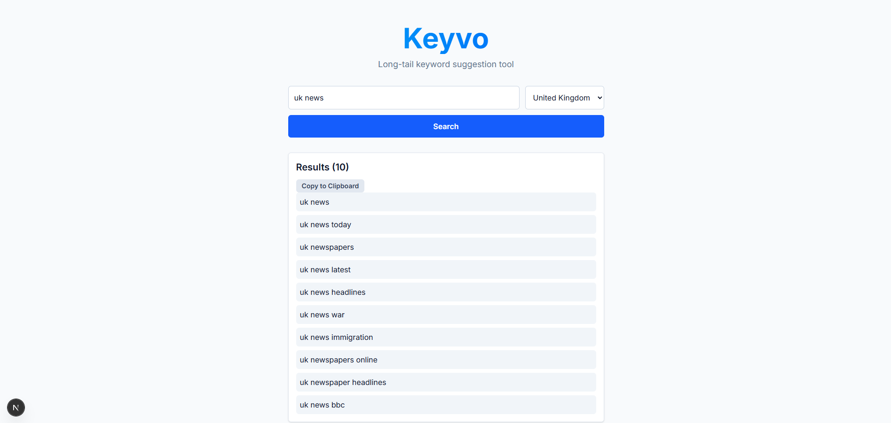

# Keyvo

A lightweight, open-source keyword suggestion tool using unofficial autocomplete API.

## Tech Stack
- Backend: FastAPI (Python) 
- Frontend: Next.js (React) & Tailwind CSS

## Getting Started
### Backend (FastAPI)

1. Navigate to the API directory: ``cd api``
2. Create Python virtual environment: ``python -m venv venv``
3. Activate Python virtual environment: `source venv/bin/activate` (`.\venv\Scripts\activate`)
4. Install required dependencies: ``pip install -r requirements.txt``
5. Run the backend server: ``uvicorn main:app --reload``

### Frontend (Next.js)
1. Navigate to the frontend directory: ``cd keyvo-frontend``
2. Install the required dependencies: ``npm install``
3. Run the frontend server: ``npm run dev``

**Note: You need to run both simultaneously.**
